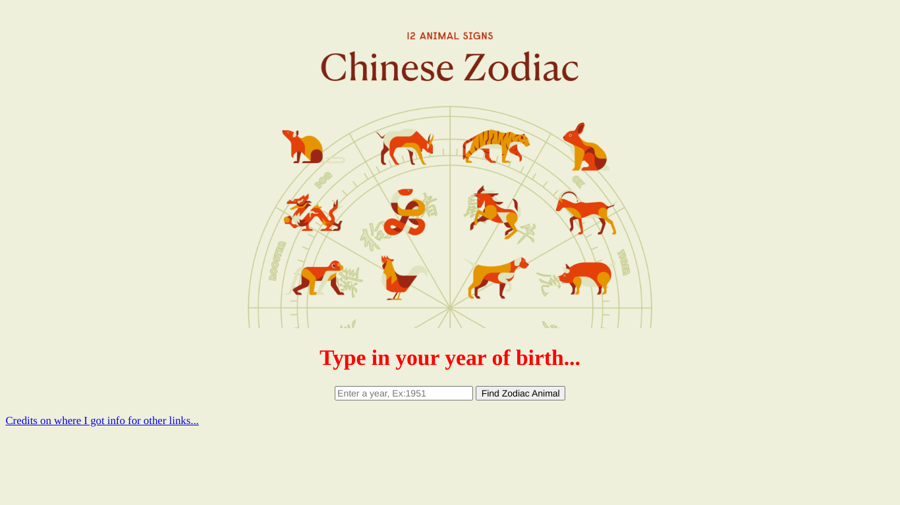
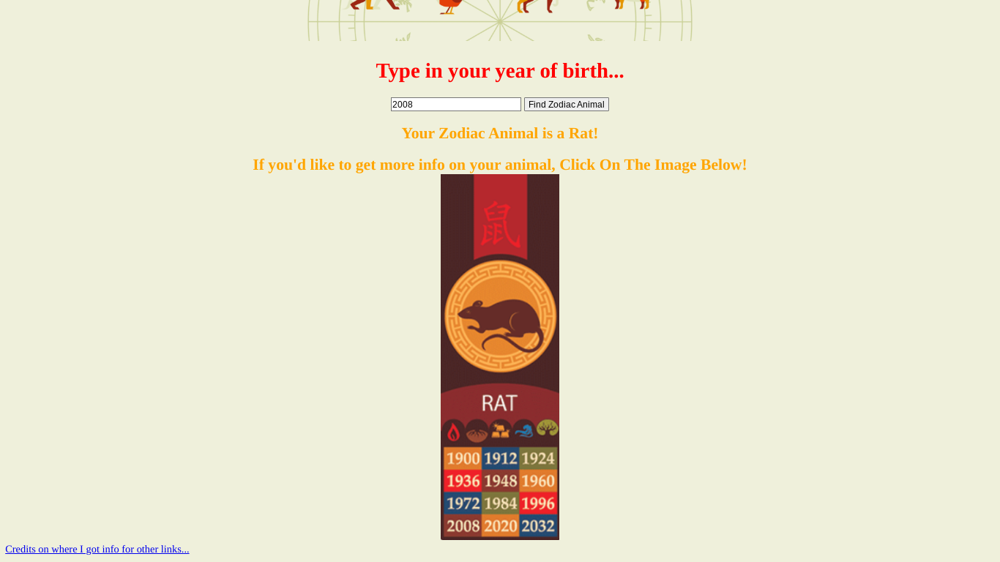

# Zodiac-Animal-Project

##  code qualities...

#### breif description
-This code was inspired by other zodiac animal websites sort of. 
the way it works is a user inputs their year of birth, just the year, Ex: 2009 
after pressing the find-zodiac button it will then display only the neccesary link and words depending on the year that was inputed,
The link (also a pressable image) will lead to a more info page on that animal, the buttons there are interactive and display or don't display as you press them

#### general descriptions of different files
-The initial file that will show up when you press the actual link to the website is the index.html, 
The other html files hold all the extra info on the different kinds of animals 
The css file hodls all the styles, mostly just used the center-text on their and some different colors and what not
The scrips.js file is the functionality of my code, from how the website searches for your animal that you put in 
and also the buttons functionality. How some things are displayed as well.

#### credits to Ai
-I didn't use Ai all that much, The duck did give me pointers on how to use class.list and element(highlighted orange) 
some syntax for how to style things here and there
The one main thing it did do (chat helped me on this one) was the for loop where it resets all the links in the searchZodiac function.
I was kind of at a loss when It came to that, I had a general idea but chat corrected me. 

## Screenshots

### Main Page

### Zodiac Result Example

### Video!!!
[Watch a video demo on Loom](https://www.loom.com/share/8b16e07bce3543839d9efffcbc4b8cc3?sid=f45a1809-e466-40da-8db2-4964c45843ae)

